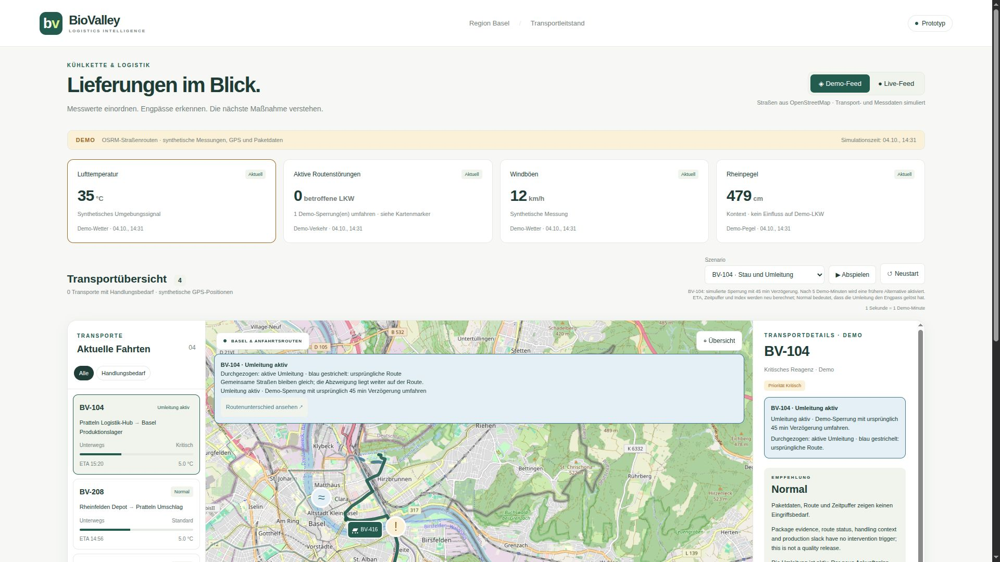

Built at HackAmRhein 2026 · [Participant setup guide](HACKAMRHEIN.md)

# BioValley — Logistics Intelligence

A Basel cold-chain dashboard for logistics and manufacturing staff. It brings public weather, traffic and Rhine observations together with simulated shipment scenarios to explain priority, rerouting and quality-review decisions.



## Run

Install **Python 3.10+** and **Node.js with npm**. From the repository folder, run:

```sh
python3 scripts/start-presentation.py
```

On Windows, use `python` instead of `python3`.

The launcher installs frontend dependencies, builds the dashboard and opens it in your browser. Use **Demo-Feed** without credentials. Press **Ctrl+C** to stop.

Internet is needed for the first installation and map tiles. **Live-Feed** also needs local credentials: see [collector setup](pythontest/README.md) and [database setup](supabase/README.md). Add `--no-collector` for Demo only, or `--port 8001` if port 8000 is occupied.

## Sources and limits

[Sources and licences](docs/SOURCES.md) include MeteoSwiss, Basel-Stadt, OpenTransportData, Port of Switzerland and OpenStreetMap.

Demo shipments, GPS, temperatures and disruptions are synthetic. Live mode has no shipment feed. The priority index is illustrative; this prototype cannot authorize dispatch or product release. [Design](docs/design.md) · [Calculation details](docs/risk-assessment.md) · [Plan](docs/plan.md)

## Team

@gggnnnttt · @Elton53 · @EdonKurtaj — [working agreements](TEAM.md)
